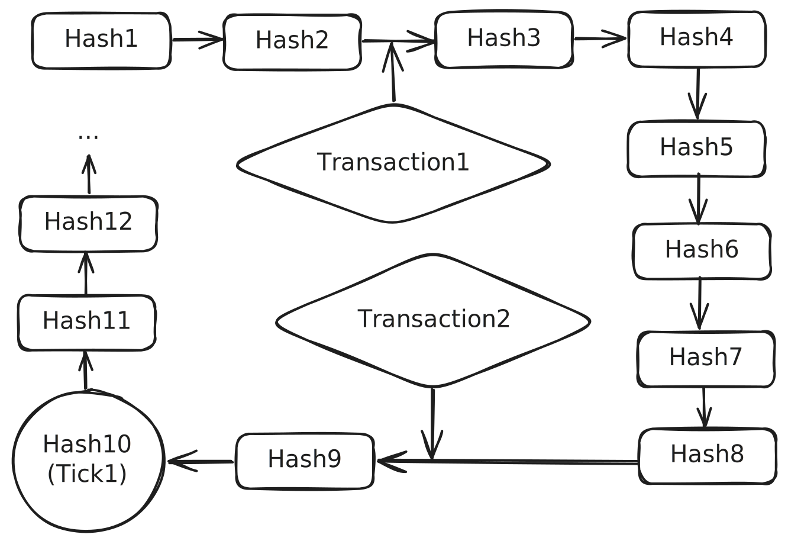

# Proof-of-History Demo

## What is Proof-of-History?

Proof of History (PoH) is a cryptographic innovation developed by Solana to create a historical record that proves events occurred at specific times. PoH works by using a sequence of SHA-256 hashes, where each hash includes the result of the previous hash, creating a verifiable chain. Each hash computation takes a consistent and verifiable amount of time, which demonstrates the passage of time between events. By including events in this hash sequence, PoH timestamps them, proving their order and timing. Nodes can compute PoH independently, reducing communication overhead and enhancing scalability.

PoH enables quick consensus without the need for extensive network validation, significantly improving speed and throughput. This efficiency allows Solana to process thousands of transactions per second, making it one of the fastest blockchain platforms available. The sequential nature of the hash chain ensures the integrity and security of the historical record, making it difficult for malicious actors to alter. Additionally, the deterministic nature of PoH allows for easy verification of the blockchain's history.

**Note**: In my humble opinion one of the best explanations of this concept can be found in [this video](https://www.youtube.com/watch?v=079mUCjYpZs).

## Some Important Functions

* `Poh::tick()` - Updates the internal counter to generate a new tick entry, indicating the passage of time in the PoH ledger. This step includes one application of the hash function.
* `Poh::record()` - Hashes the provided (transaction) data to produce a new hash in the sequence.
* `Poh::hash()` - Computes a number of sequentially nested hashes, extending the PoH chain.
* `PohRecorder::record()` - Records a batch of transactions in the PoH ledger for a given bank slot. It ensures the transactions are processed in order and handles potential shutdown scenarios.
* `PohService::tick_producer()` - Produces ticks at regular intervals, ensuring the PoH ledger is continuously updated with new ticks. It handles transaction recording and hashing in an efficient manner. This function runs indefinitely until the exit signal (atomic bool) is set to true.

## The PoH Demo

I have written a very simplistic code to demonstrate the concept of Proof-of-History. The `PohService` type is designed to continuously process incoming messages and generate periodic hash batches. It emits events based on the messages received and the internal tick mechanism, which is driven by a fixed interval.
